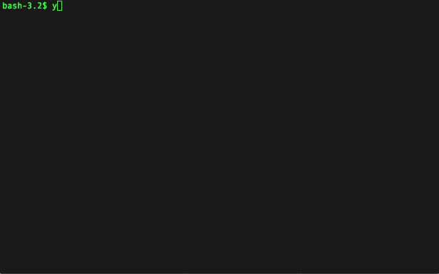

# Confit 

> Yeoman generator for creating the development process, tools and a sample project for current-generation web applications.

<!---->

[Concept Video](https://vimeo.com/128842400)

# Table of Contents

- [Introduction](#introduction)
  - [Features](#features)
  - [Pre-requisites](#pre-requisites)
  - [Install](#install)
  - [Usage](#usage)
  - [Contributing](#contributing)
- [Background](#background)
  - [Con-waaat?!?](#con-waaat)
- [Using Confit](#using-confit)
  - [Sample Projects](#sample-projects)
  - [Smart upgrading](#smart-upgrading)
- [Sponsors](#sponsors)

# Introduction

## Features

- Write code using ES5, ES6+ (using Babel) or TypeScript
- Write plain CSS, SASS/SCSS or Stylus
- Optional linting of CSS and JS code
- Unit testing 
- Browser testing
- Support for releasing code using semantic releasing, conventional commits
- Supports Angular 1.x and Angular 2.x frameworks, and more coming (PRs welcome!!!) 
- Sample projects for some configurations (see below)
- EXTENSIBLE! Decorate / extend configurations then re-run `yo confit` to re-generate configuration while preserving your changes (uses tags to identify generated-areas inside files) 

## Pre-requisites

- Node 4.x
- NPM 3.x (especially for Windows users)

## Install

    npm install -g yo
    npm install -g generator-confit
    
    
## Usage

    yo confit [--skip-install] [--skip-run]
    
- `--skip-install` skips the installation of NPM and Bower dependencies
- `--skip-run` skips the run command, which normally starts the build tool in develop mode (`npm run dev`)

## Contributing

Want to make life easier for web developers? Fix a bug? Become a [contributer](CONTRIBUTING.md)!

# Background

## Con-waaat?!?

Confit is a Yeoman generator that generates web-development tools for the main development processes in web projects:

- develop
- build
- verify
- test
- release

The tooling is generated by answering a series of simple questions about your project, turning a process that used to take weeks to
tune correctly, into a 5 minute step. See the animated-gif above for an example.
 
***Out of the box, Confit can generate a sample project for the settings you've chosen and so you can see that everything works!***

### In more detail...

> Confit isolates you from the constant-churn of Javascript frameworks so that you can get started with a build-system
  which "just works". And in a few months time when you want to use newer tools, migration will be easier (than if you hadn't used Confit).

- Confit is a **web development-tool generator** that is designed to evolve as web technologies change.
- Confit captures a project's build processes in a **build-tool-independent configuration file** (`confit.yml`), so you can *migrate your configuration to use newer build-tools more-easily*.
- Confit is **aimed at** generating tools for single-page web applications (SPAs), but will soon support generating ES6 NodeJS libraries too (see issue #17)
- Confit is **opinionated**. For example, Confit does not advocate the use of BowerJS. If you need it, look elsewhere. (Or create an NPM module if one doesn't already exist for the Bower library you need).
- Confit-generated config can be customised AND still preserve your changes (so long as you make changes outside of the generated sections)

> Confit wants to capture the information about your project which **will not** change when your build-tooling changes.
  This is the essence of Confit - **decoupling your *project configuration* from the *build-tool implementation* of that configuration.** 

# Using Confit

## Sample projects

Confit can generate a sample project implemented using the chosen combination of technologies and tools.
*It is recommended to generate the sample project the first time you run `yo confit`.* 

There are sample project implementations for the following technology combinations:

Build Profile | JS Source Format | JS Frameworks Supported (optional)
:------------ | :--------------- | :----------------------
Webpack       | ES6              | Angular 1.x, Angular 2
Webpack       | Typescript       | Angular 1.x, Angular 2

All sample projects support the chosen CSS compiler (or plain CSS files).

## Smart upgrading

Confit is designed to be hassle-free when upgrading. As well as using semantic versioning, 
Confit has some smarts to make upgrading simple even when there are "breaking changes".
*It is always a good idea to commit all your source code to a repo BEFORE upgrading, so that if the upgrade doesn't 
turn out how you expected, you can revert to the previous version of the code.*

Each Confit generator (Confit is composed of multiple generators) contains a version identifier. 
When you upgrade to a new version of Confit, if any of the new generators have changed, 
Confit will detect this and the generator will re-ask the questions for that section. 
That will cause the generator's version in your `confit.yml` file to be updated, as well
 as new information being added to the file in some cases. Old / deprecated information will not be automatically removed.

Similarly for the generated tools, if the tooling changes, or you choose to use a different build profile which 
uses different tools, the old tools' files will not be removed.

### Upgrading README.md & CONTRIBUTING.md content

There are several tags available for inserting generated content into the README.md file and CONTRIBUTING.md. 
Information inside README.md is aimed at end-users (consumers) of the package. Information inside CONTRIBUTING.md is
aimed at developers who need to modify the package.

Tag | Description | Example
:-- | :-----------| :------
<pre>&lt;!--[RM_HEADING]-->&#10;&lt;%- RM_HEADING %&gt;&#10;&#10;<!--[]--></pre> | The package *name* as captured in the `package.json`, rendered as a H1 heading | # package-name
<pre>&lt;!--[RM_DESCRIPTION]-->&#10;&lt;%- RM_DESCRIPTION %&gt;&#10;&#10;<!--[]--></pre> | The package *description* as captured in the `package.json`, rendered as a block quote | > A description of my awesome package
<pre>&lt;!--[RM_INSTALL]-->&#10;&lt;%- RM_INSTALL %&gt;&#10;&#10;<!--[]--></pre> | The installation commands for the package, from a consumer's perspective | `npm install sample-app`
<pre>&lt;!--[RM_DIR_STRUCTURE]-->&#10;&lt;%- RM_DIR_STRUCTURE %&gt;&#10;&#10;<!--[]--></pre> | A tree representation of the directory structure | 
<pre>&lt;!--[RM_CONTRIBUTING]-->&#10;&lt;%- RM_CONTRIBUTING %&gt;&#10;&#10;<!--[]--></pre> | A link to `CONTRIBUTING.md` | ## Contributing  See [CONTRIBUTING.md](CONTRIBUTING.md).
<pre>&lt;!--[RM_LICENSE]-->&#10;&lt;%- RM_LICENSE %&gt;&#10;&#10;<!--[]--></pre> | A link to the `LICENSE` file | ## License  This software is licensed under the MIT Licence. See [LICENSE](LICENSE).
<pre>&lt;!--[CN_HEADING]-->&#10;&lt;%- CN_HEADING %&gt;&#10;&#10;<!--[]--></pre> | Heading for `CONTRIBUTING.md` | # Contributing  Welcome! Thanks for taking some time to find out more about how you can make **package-name** even better.
<pre>&lt;!--[CN_GETTING_STARTED]-->&#10;&lt;%- CN_GETTING_STARTED %&gt;&#10;&#10;<!--[]--></pre> | Getting started with contributing to the project | # Getting Started.
<pre>&lt;!--[CN_GITFLOW_PROCESS]-->&#10;&lt;%- CN_GITFLOW_PROCESS %&gt;&#10;&#10;<!--[]--></pre> | Description of the GitFlow development process | # GitFlow Development Process  This project uses the [GitHub Flow](https://guides.github.com/introduction/flow/index.html) workflow...
<pre>&lt;!--[CN_BUILD_TASKS]-->&#10;&lt;%- CN_BUILD_TASKS %&gt;&#10;&#10;<!--[]--></pre> | A list of the *build*-related commands | `npm run build`
<pre>&lt;!--[CN_TEST_TASKS]-->&#10;&lt;%- CN_TEST_TASKS %&gt;&#10;&#10;<!--[]--></pre> | A list of the *test*-related commands | `npm test`
<pre>&lt;!--[CN_VERIFY_TASKS]-->&#10;&lt;%- CN_VERIFY_TASKS %&gt;&#10;&#10;<!--[]--></pre> | A list of the *verify*-related commands | `npm run verify`
<pre>&lt;!--[CN_COMMIT_TASKS]-->&#10;&lt;%- CN_COMMIT_TASKS %&gt;&#10;&#10;<!--[]--></pre> | A list of the *commit*-related commands | `git status`
<pre>&lt;!--[CN_RELEASE_TASKS]-->&#10;&lt;%- CN_RELEASE_TASKS %&gt;&#10;&#10;<!--[]--></pre> | A list of the *release*-related commands | `npm run release`
<pre>&lt;!--[CN_CHANGING_BUILD_TOOL_CONFIG]-->&#10;&lt;%- CN_CHANGING_BUILD_TOOL_CONFIG %&gt;&#10;&#10;<!--[]--></pre> | Information on how to safely change the generated configuration | ## Changing build-tool configuration  There are 3 ways you can change the build-tool configuration for this project...

#### Why the strange template syntax?
The template syntax has to parsable as an EJS template, valid HTML and valid Markdown in both Stash and GitHub. Each syntax treats whitespace slightly differently. 
This syntax allows the templates to be inside the markdown files without being visible when rendered as HTML. 

## Sponsors

These are the companies that are sponsoring the development of Confit:

